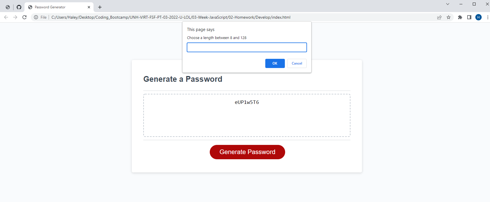

# Password Generator

This is a basic HTML, CSS, and Javascript page. It will generate a random password following a series of prompts during which the user will select password criteria - it's length and which character types to inclue.

[Deployed page](https://mendelism.github.io/password-generator/)